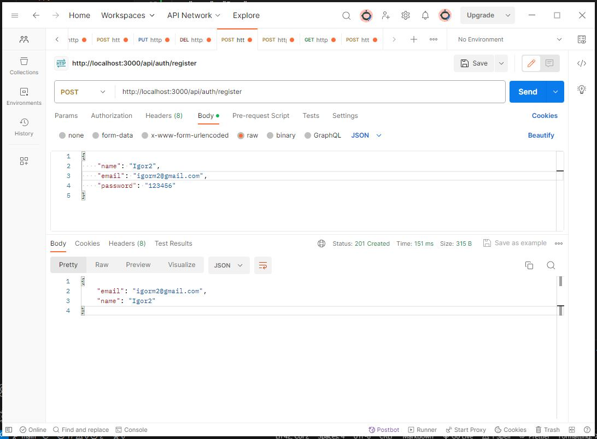
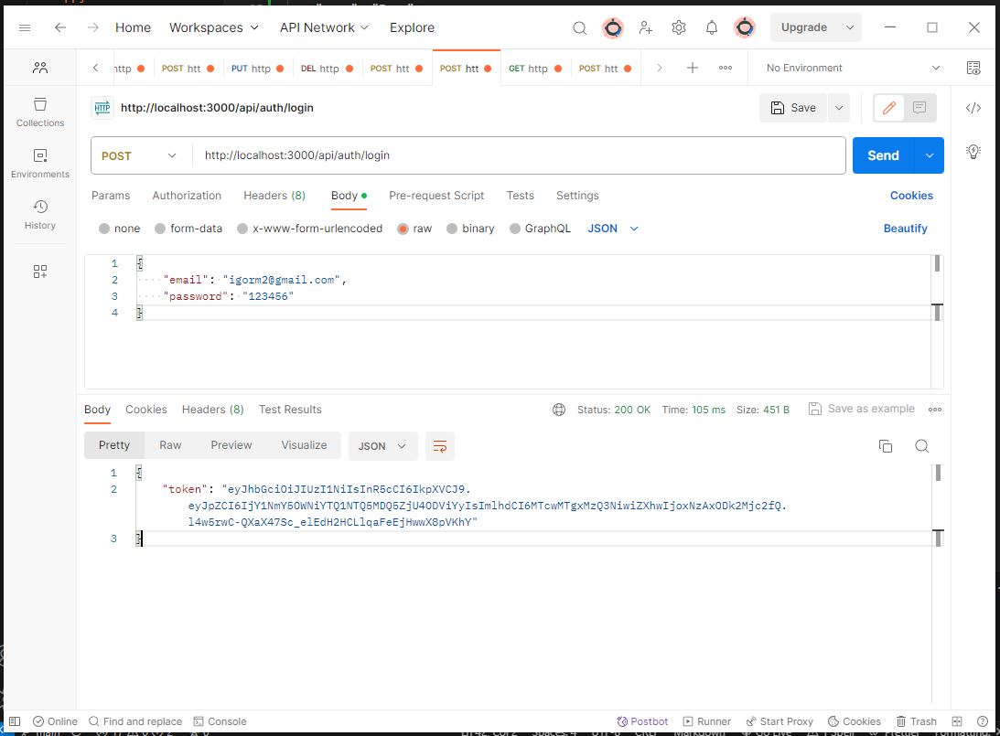
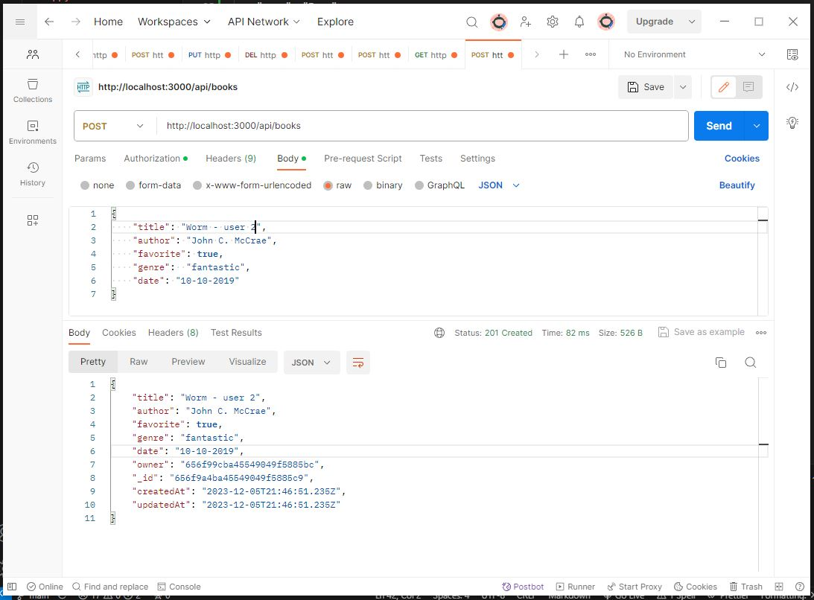
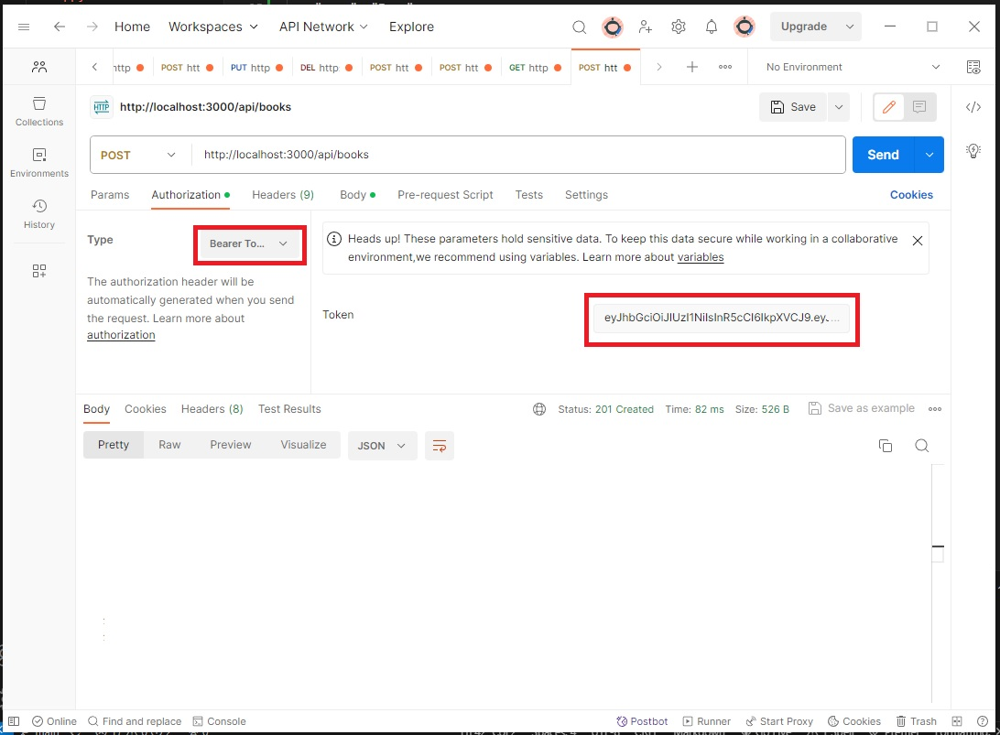
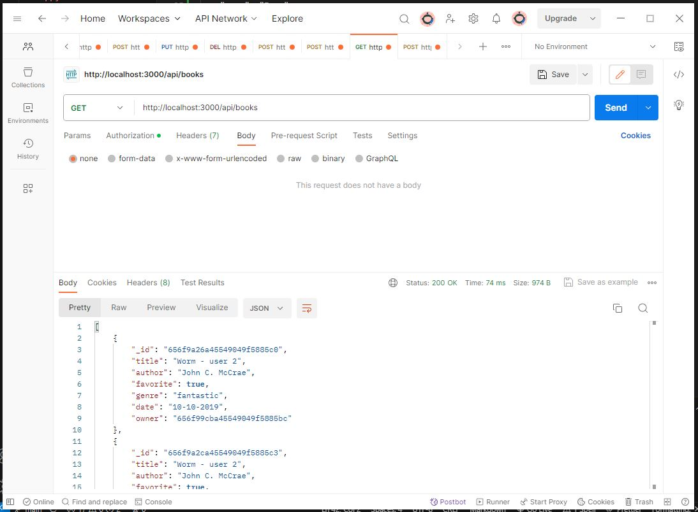
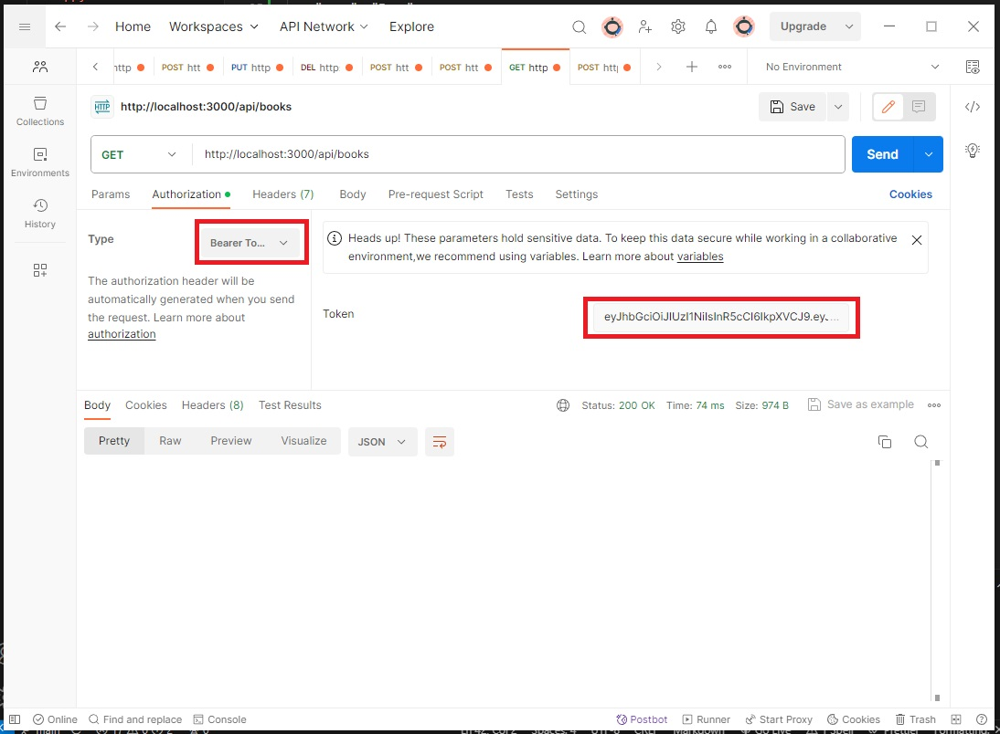
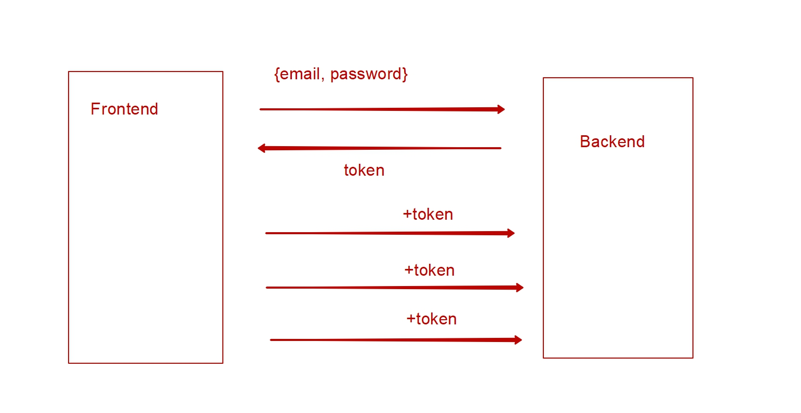
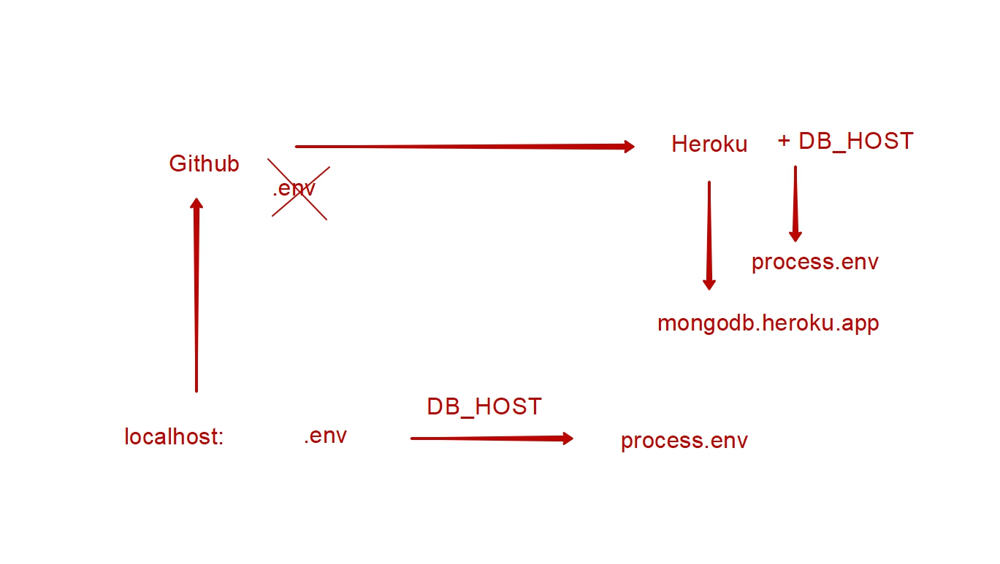

## books-reader-backend-auth
### Mod04-1

#### POST http://localhost:3000/api/auth/register  

{  
    "name": "Vasyl",  
    "email": "vasyl@gmail.com",  
    "password": "123456"  
}

#### POST http://localhost:3000/api/auth/login  

{  
    "email": "vasyl@gmail.com",   
    "password": "123456"  
}  

### Mod04-2

#### POST http://localhost:3000/api/auth/register

{  
    "name": "Igor",  
    "email": "igorm@gmail.com",  
    "password": "123456"  
}  
{  
    "name": "Igor2",  
    "email": "igorm2@gmail.com",  
    "password": "123456"  
}  

#### POST http://localhost:3000/api/auth/login

{  
    "email": "igorm2@gmail.com",  
    "password": "123456"  
}  

{  
    "token": "xxxxxx"  
}  

#### POST http://localhost:3000/api/books

Header > Authorization Bearer "token"  

{  
    "title": "Worm - user 2",  
    "author": "John C. McCrae",  
    "favorite": true,  
    "genre":  "fantastic",  
    "date": "10-10-2019"  
}  

#### GET http://localhost:3000/api/books

Header > Authorization Bearer "token"   

-  Pagination   
#### GET http://localhost:3000/api/books?page=2&limit=2

Header > Authorization Bearer "token"  

#### GET http://localhost:3000/api/auth/current

Header > Authorization Bearer "token"  

{  
    "email": "igorm2@gmail.com",  
    "name": "Igor2"  
}  

#### POST http://localhost:3000/api/auth/logout

Header > Authorization Bearer "token"   

